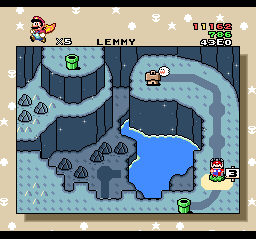

[English README is here](README.md)

# SMW Lemmy Helper

SMW Lemmy Helperは、スーパーマリオワールドの「バニラドームのしろ」における乱数調整の研究を目的としたパッチです。
現在の乱数だけでなく、現在の乱数の通し番号も表示されるため、乱数表から現在の乱数を探さなくても乱数がどの程度進んでいるかが分かります。

## パッチの当て方

1. 日本版のROMにパッチを当てる場合は LemmyHelper_J.bps を、北米版のROMにパッチを当てる場合は LemmyHelper_U.bps をダウンロードしてください。
2. [BPSパッチ適用ツール](https://web.save-editor.com/tool/rom_patcher_for_bps.html) を開き、ROMファイルとBPSファイルを選択してください。
3. "SNES HEADER (HEADERLESS)" を選択し、CRC32がOKであることを確認してください。
4. 適用ボタンをクリックしてください。

## マップ画面の機能

* Rを押すと、マリオのパワーアップ状態が変わります。
* Selectを押すと、マリオのパワーアップ状態とアイテムストックが入れ替わります。
* ←または→を押すと、スタート地点をROOM 1、MIDWAY、ROOM 3、LEMMYから選択できます。
* マリオがアイテムを取得したりダメージを受けたりしても、ステージを抜けてマップに戻ると、マリオのパワーアップ状態とアイテムストックがスタート時の状態に戻ります。

ROOM 3またはLEMMYが選択されている場合、以下の機能が有効になります。

* ↑を押すと、スタート時の乱数のインデックスが1ずつ進みます。
* ↓を押すと、スタート時の乱数のインデックスが1ずつ戻ります。
* X+↑またはY+↑を押すと、スタート時の乱数のインデックスが100ずつ進みます。
* X+↓またはY+↓を押すと、スタート時の乱数のインデックスが100ずつ戻ります。
* ROOM 3が選択されている時にLを押すと、スタート時の乱数が0000(0)、F040(295)、C67C(572)の順に切り替わります。
* LEMMYが選択されている時にLを押すと、スタート時の乱数がE819(214)、E17E(509)、43E0(786)の順に切り替わります。
* ROOM 3からスタートする時の乱数とLEMMYからスタートする時の乱数は別々に保存されます。
* スタート時の乱数とそのインデックスが画面の右上に表示されます。
* LEMMYが選択されている場合、レミーの出現順が画面の右上に表示されます。 
  赤は横向きのポーズを、黄色はその他のポーズを表します。

## ステージ中の機能

* Start-Selectでステージを抜けることができます。
* 城に入る時と城を破壊する時の演出をスキップします。
* 現在の乱数とそのインデックスが画面の左上に表示されます。
* レミーの部屋にいる時、レミーの出現順が画面の左上に表示されます。 
  赤は横向きのポーズを、黄色はその他のポーズを表します。
