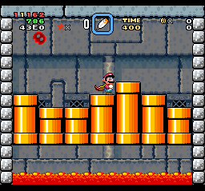

[日本語版 README はこちら](README-ja.md)

# SMW Lemmy Helper

SMW Lemmy Helper is a patch designed for studying random number adjustment in "Lemmy's Castle" in Super Mario World.
Not only the current random number but also index of the current random number is displayed, so you can see how far the random number has progressed without having to search for the current random number from the random number table.

## How to Patch

1. Download LemmyHelper_J.bps to patch the Japanese ROM or LemmyHelper_U.bps to patch the U.S. ROM. 
2. Open [BPS PATCHER](https://web.save-editor.com/tool/rom_patcher_for_bps.html), then select the ROM file and BPS file.
3. Select "SNES HEADER (HEADERLESS)" and make sure CRC32 is OK.
4. Click the APPLY button.

## Overworld Features

* Press R to change Mario's powerup status.
* Press Select to swap the current powerup with item box powerup.
* Press Left or Right to select the starting point from ROOM 1, MIDWAY, ROOM 3, or LEMMY.
* Even if Mario gets an item or takes damage, his power-up state and item box will return to their original states before entering the level when he exits the level and the overworld is loaded.

When ROOM 3 or LEMMY is selected, the following features are enabled.

* Press Up to increment the random number at start by one.
* Press Down to decrement the random number at start by one.
* Press X+Up or Y+Up to increment random number at start by 100.
* Press X+Down or Y+Down to decrement random number at start by 100.
* When ROOM 3 is selected, press L to toggle random number at start in the order 0000(0), F040(295), C67C(572).
* When LEMMY is selected, press L to toggle random number at start in the order E819(214), E17E(509), 43E0(786).
* The random number when starting from ROOM 3 and the random number when starting from LEMMY are saved separately.
* The starting random number and its index are displayed in the upper right corner of the screen.
* When LEMMY is selected, the order in which Lemmy appear is displayed in the upper right corner of the screen. 
  Red indicates sideways poses; yellow indicates other poses.

## Level Features

* You can exit the level by Start-Select.
* "MARIO START" and the level-beaten cutscenes are disabled.
* The current random number and its index are displayed in the upper left corner of the screen.
* When you are in Lemmy's room, the order in which Lemmy appear is displayed in the upper left corner of the screen. 
  Red indicates sideways direction; yellow indicates other directions.
